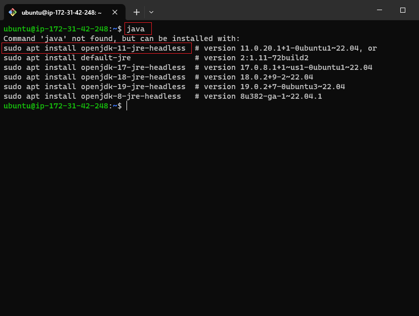

# Ansible Automate Project 

## Install Jenkins

First i create an Ec2 instance and name it `Jenkins` and ssh into it

next i update the server

```
sudo apt update
```


to install `JAVA` i typed the command below to know which java version to install

```
java
```



next i install java for this i installed version 11 using the command below


```
sudo apt install openjdk-11-jre-headless
```


next i install jenkins on ubutu server.I  used the code located in this website link to do so 

`jenkins.io/doc/book/installing/linux/#debianubuntu`


using the command on the website i installed jenkins


next i check the status of jenkins using the command below

```
sudo systemctl status jenkins
```


if jenkns is active i type the command below into my web browser 

```
<server-public-ip>:8080
```


to get administrator password i use the command below

```
sudo cat /var/lib/jenkins/secrets/initialAdminPassword
```


next i select install suggested plugins


afterwhich i create the `First Admin user` inputing `username`, `password`, `fullname`, `email address`

the end result should look like this


<br/>
<br/>
<br/>
<br/>
<br/>
---------------------------------------------------

# Install and configure ansible on ec2 instance

### Step 1 - Install and Configure Ansible on EC2 Instance


I changed the name of my jenkins Ec2 instance to Jenkins-Ansible


next i Ssh into my Jenkins-Ansible

next i updated my server using the command below

```
sudo apt update
```


next i installed ansible


next i checked ansible version to confirm ansible is installed

```
ansible --version
```


### on jenkins webpage - Configure Jenkins build job to archive your repository content every time you change it

i created a freestyle project

select `new item`


next enter an `item name` and choose `freestyle project` and select `ok`


### on Github 

i created a new repository 


click on `settings`


select `webhooks` and `add webhook`


on the `payload url` input the following

```
http://<jenkins-server-public-ip-address>:8080/<any-name>/
```

`content type` is `application/json`

`events` is `just the push event`

tick `active`

afterward update workbook


### on jenkins webpage

navigate to 

```
http://<jenkins-server-public-ip-address>:8080/job/ansible/configure
```


input the settings shown in the images below

the repository url is the github url repository link created above 


apply and save

on the dashboard i navigate to the `ansible` freestyle project and click on build now and check the build number. if its green the build is correct and free of errors


I tested my setup by making some change in README.md file and made sure that builds starts automatically and Jenkins saves the files (build artifacts) in following folder


```
sudo ls /var/lib/jenkins/jobs/ansible/builds/<build_number>/archive/
```

```
sudo ls /var/lib/jenkins/jobs/ansible/builds/
```


## Note: Trigger Jenkins project execution only for main (or master) branch.

to see the content of the README.md file on console i used the command below

```
sudo cat /var/lib/jenkins/jobs/Ansible/builds/<build-number>/archive/README.md
```
but first i changed the pwd directory to the archive directory in the image below


#### note: Every time i stop/start my Jenkins-Ansible server - i reconfigured GitHub webhook to the new IP address, in order to avoid repeating this, it makes sense to allocate an Elastic IP to my Jenkins-Ansible server.


## Prepare your development environment using Visual Studio Code

first i inatalled `Remote Development` plugin


next i connect to my Github repository


### Begin Ansible Development

i checked the github branches in the repository

```
git branch
```

create a new branch

```
git checkout -b <branch-name>
```

create a new directory `playbooks`

```
mkdir playbooks
```

create a new directory `inventory`

```
mkdir inventory
```


change working directory to playbooks

```
cd playbooks/
```

create common.yml file

```
touch common.yml
```


change working directory to `inventory`

create `dev.yml`, `staging.yml`, `uat.yml`, `prod.yml` file 


### on windows diretory i added ssh agent

first i changed working directory(pwd) to the location of my private key 

next i typed the command below to obatain `agent pid`

```
eval `ssh-agent -s`
```

```
ssh-add <private-key-name>.pem
```

```
ssh-add bright-usa.pem
```

to connect to the jenkins-ansible instance directly using ssh agent

```
ssh -A ubuntu@<ec2-public-ip-address>
```


next is to persist the key on the server


next i created five(5) new ec2 server with the following description

```
* one nfs server running red-hat os 

* two web-servers running red-hat os

* one database server running red-hat os

* one loadbalancer server running ubuntu os

```

#### i created the instances using the same key pair


i checked if i can connect to the new instances from jenkins server using the command below

```
ssh <os-refrence>@<server-public-ip-address>
```

> os refrence can either be `ubuntu` or `ec2-user`


#### on vscode 

i typed the following command into the dev.yml file 

```
[nfs]
<NFS-Server-Private-IP-Address> ansible_ssh_user='ec2-user'

[webservers]
<Web-Server1-Private-IP-Address> ansible_ssh_user='ec2-user'
<Web-Server2-Private-IP-Address> ansible_ssh_user='ec2-user'

[db]
<Database-Private-IP-Address> ansible_ssh_user='ec2-user' 

[lb]
<Load-Balancer-Private-IP-Address> ansible_ssh_user='ubuntu'
```


#### on common Playbook

i typed the command below


```
---
- name: update web, nfs and db servers
  hosts: webservers, nfs, db
  become: yes
  tasks:
    - name: ensure wireshark is at the latest version
      yum:
        name: wireshark
        state: latest
   

- name: update LB server
  hosts: lb
  become: yes
  tasks:
    - name: Update apt repo
      apt: 
        update_cache: yes

    - name: ensure wireshark is at the latest version
      apt:
        name: wireshark
        state: latest
```

```
---
- name: update web, nfs and db servers
  hosts: webservers, nfs, db
  remote_user: ec2-user
  become: yes
  become_user: root
  tasks:
    - name: ensure wireshark is at the latest version
      yum:
        name: wireshark
        state: latest
   
- name: update LB server
  hosts: lb
  remote_user: ubuntu
  become: yes
  become_user: root
  tasks:
    - name: Update apt repo
      apt: 
        update_cache: yes

    - name: ensure wireshark is at the latest version
      apt:
        name: wireshark
        state: latest

```


### Updating Github repository

```
git status
```

```
git add .
```

```
git commit -m "<make-any-comment>"
```

```
git push origin <branch-name>
```


i changed my working directory and run the the above git commands 


afterward i created a pull request


after a change on my main branch jenkins automatically build artifacts to save the files 


contents of files changes can also be seen


with every changes made a new build number is generated


to see the changes on the `jenkins-ansible` server i use the command below with respect to the build number to see any changes made and recorded

```
sudo ls /var/lib/jenkins/jobs/ansible/builds/<build_number>/archive/
```


#### on the vscode

changed branch to main

```
git checkout main
```

check main branch status

```
git status
```

pull from remote repository

```
git pull
```


## Run  Ansible test

i connect to host folloing the image below


copied the public address of jenkins-ansible server


ssh into development in vscode


choose platform


encountered error


open configuration


after opening the configurations file i type the command below

```
# Read more about SSH config files: https://linux.die.net/man/5/ssh_config
Host Jenkens-Ansible
    HostName 34.227.102.109
    User ubuntu
    IdentityFile /Users/BRIFAV-PC/Downloads/bright-usa.pem
    ForwardAgent yes
    ControlPath /tmp/ansible-ssh-%h-%p-%r
    ControlMaster auto
    ControlPersist 10m

```


#### on the jenkins-ansible server

i typed the command below to execute the playbook

```
ansible-playbook -i /var/lib/jenkins/jobs/Ansible/builds/<build_number>/archive/inventory/dev.yml /var/lib/jenkins/jobs/Ansible/builds/<build_number>/archive/playbooks/common.yml
```


## HURRAY !!!

i check for wireshark in all the servers using the command below

```
which wireshark
```

or 

```
wireshark --version
```


<br/>
<br/>
<br/>
<br/>

### Challenges and solutions

#### JENKINS CONNECTIVITY CHALLENGE ENCOUNTERED


to solve the error above i adjusted the security settings using the steps below

first i visited the web directory below

```
<public-ip-address>:8080/manage
```

afterwhich i navigated to `security settings` and changed the settings as seen in the image below

```
<public-ip-address>:8080/manage/configureSecurity/
```


#### SOLVED


#### error when ssh into a new server from desktop

i use the command below

```
eval `ssh-agent -s
```

```
ssh-add <private-key>.pem
```

```
ssh -A ubuntu@<server-public-ip
```

```
ssh-add -l
```
